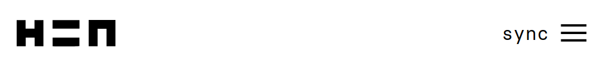
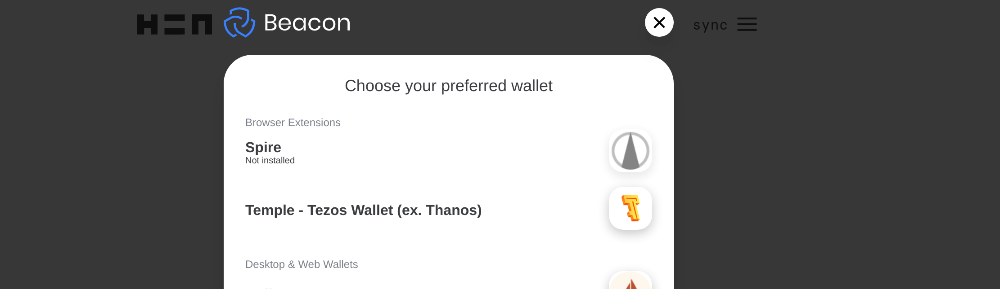
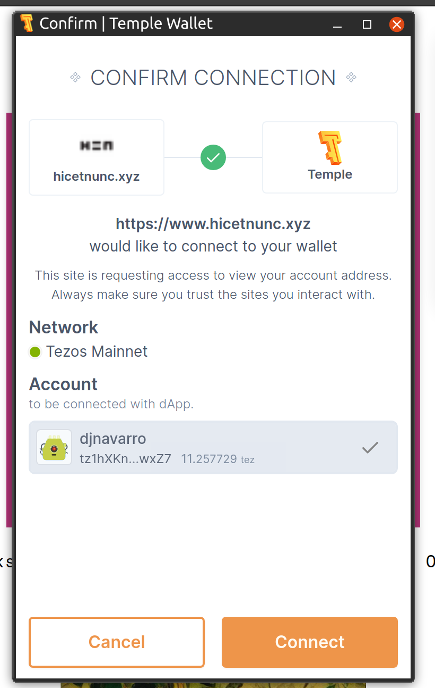
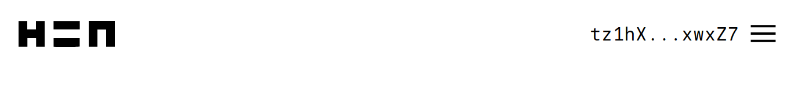
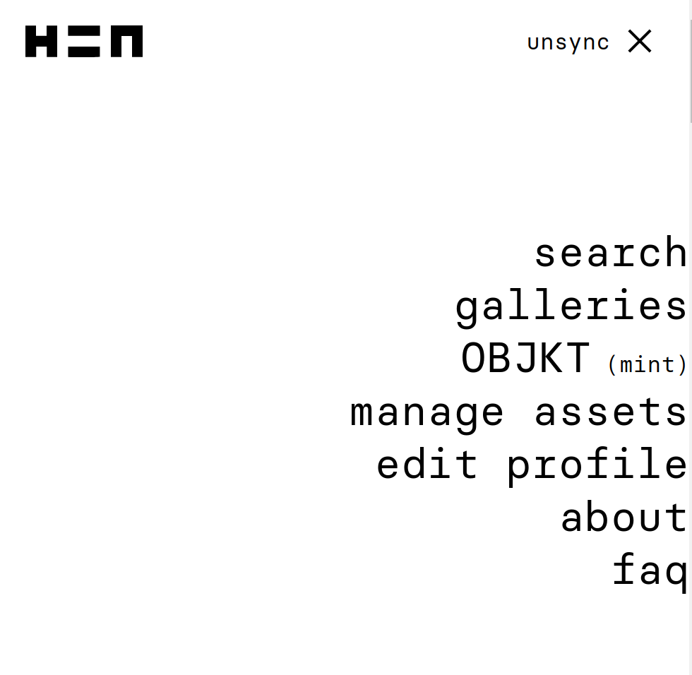
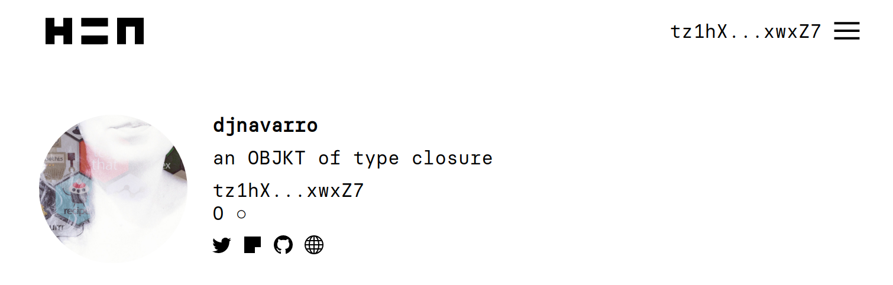
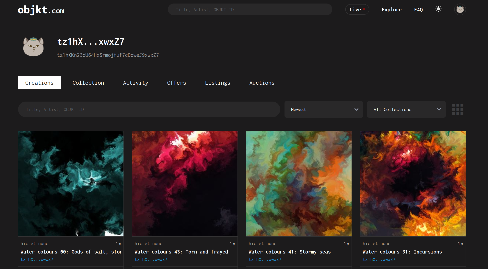
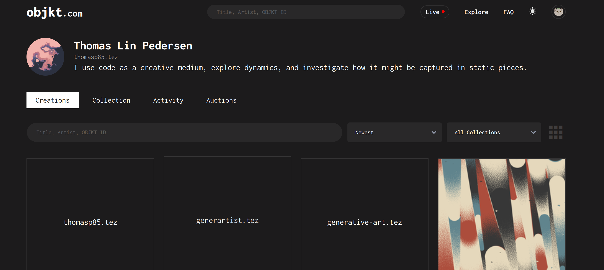
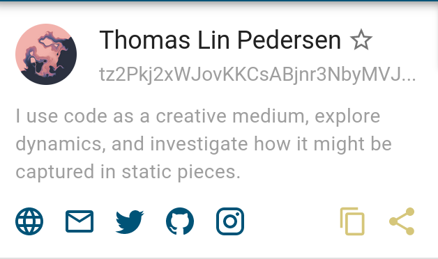
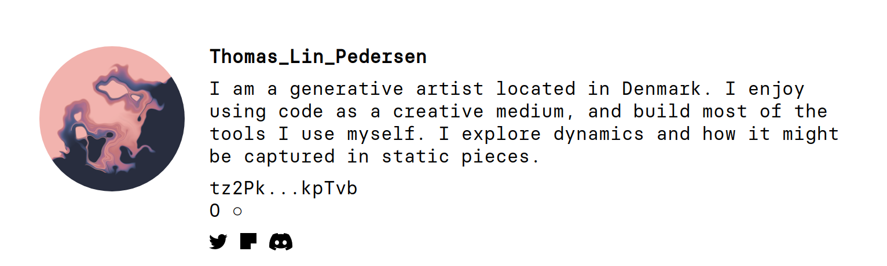

<!--------------- setup post ----------------->

```{r setup, include=FALSE}
knitr::opts_chunk$set(echo = TRUE)
refinery::renv_load(paste(params$date, params$slug, sep = "_"))
```


<!--------------- post ----------------->

Cryptoart can be a touchy subject for generative artists, and it's something a lot of us have messy feelings about. In my case it is no secret that I feel conflicted: I'm on record in multiple places expressing my reservations --  [here](https://essays.djnavarro.net/post/intimacy-and-art/) and [here](https://www.gofundme.com/f/data-science-art-to-support-a-womens-refuge) for example -- and I completely understand why a lot of us are uncomfortable with it. I genuinely believe there are many perfectly good reasons why a generative artist would choose not to participate. On the other hand, I also recognise that there are some very sensible reasons why a generative artist *would* want (or need) to sell NFTs: artists have to pay rent, for example. So this post isn't about passing judgment one way or the other. It's intended to be a guide to help other artists get started in this area, particularly artists in the R community, if they should decide to try it out. That's all. 

This post is also not supposed to be an introduction to blockchains or cryptocurrencies. It doesn't dive into the details on what these things are or even what an NFT is. I make art: I don't care about any of these subjects. What I'm assuming is that you're coming to this world from a similar position to me: you have a vague understanding of what blockchain is, what cryptocurrencies are about, and have a similarly vague notion that an NFT is kind of like a "digitally signed copy" of your art that you can sell to other people. That's all you need. 

## Prelude: Barriers to entry 

One thing I have noticed about the world of cryptoart is that there are *many* barriers to entry. Some barriers are obvious: if you want to sell art on [Foundation](https://foundation.app/about), for example, you need to be invited. To be invited, you need to know someone who can and will invite you. As anyone who has ever been excluded from a fancy venue by virtue of their race, gender, sexual orientation, transgender status etc can attest, an invitation requirement is a non-trivial and frequently discriminatory barrier. "By invitation" systems create entry barriers by design: for good or ill, they are inherently exclusionary.

Another kind of barrier comes from the nature of cryptoart. Blockchains were not designed to be energy efficient, and they can be extraordinarily wasteful (much more than you'd think). Environmental considerations also create barriers to entry. This is especially true for "proof of work" (PoW) blockchains that are staggeringly wasteful of computation time. The biggest art markets appear to be based on the Ethereum chain, which (for the time being, at least) uses proof of work, and seems indefensible from an environmental perspective. To my mind that also rules out [OpenSea](https://opensea.io/): despite being the largest marketplace and the easiest one to set up on (e.g., I have an [unused account](https://opensea.io/djnavarro) that I set up in a few minutes), it may be unacceptable to many artists for that reason.

As an alternative, there are "proof of stake" (PoS) blockchains that don't require anywhere near as much computation, and as a consequence are much more energy efficient. I'm sure a true enthusiast could tell me a lot more about the different proof of stake chains, but the one I'm most familiar with is [Tezos](https://tezos.com/). Because I have a personal aversion to "by invitation" systems and because I really don't want the planet to burn, this is appealing to me. Happily, there is an NFT art marketplace based on the Tezos chain which goes by a fancy latin name [hic et nunc](https://www.hicetnunc.xyz/): it translates to "here and now", I'm told, and is often abbreviated to "HEN" or "H=N". Also happily, you don't need an invitation, you don't need to join a club, you can just join. Best of all, there are several artists from the R community who are already on HEN. To my mind this is a big selling point because I actually *like* the R community. There are very few tech communities that have ever made me feel at home, and I deeply value those that do. I'm entirely certain that there are others I don't know about yet, but so far on HEN I've found [Thomas Lin Pedersen](https://www.hicetnunc.xyz/tz/tz2Pkj2xWJovKKCsABjnr3NbyMVJTMBkpTvb/), [Will Chase](https://www.hicetnunc.xyz/tz/tz1UTa3LDHvb1xvfcaH5evmsVMWNXQRxrYb2), [Antonio S. Chinchón](https://www.hicetnunc.xyz/tz/tz1LLd8FJJtcTfFLiJeX6UL2oYQeLLAzUH7K), and [George Savva](https://www.hicetnunc.xyz/tz/tz1X5wRkNVQG7QfUg4kSpaQbBWPzCv6wf6mV). As of a few days ago, [I'm there too](https://www.hicetnunc.xyz/tz/tz1hXKn2BcU64HxSrmojfuf7cDoweJ9xwxZ7). 

Community! Yay! 

If there's one thing I have learned from the lovely R folks on twitter, everything is better when you are part of a supportive team of people who actually care about each other and work to build each other up. From my perspective, this makes HEN the most promising option. 

Unfortunately, one big limitation to HEN is that it isn't easy to get started there. The user interface is weird, the "how to" guides aren't easy to read, and there are a lot of things that just don't make any sense until *after* you've done all the work of figuring it out. That sucks, and it is also a barrier to entry. And while I can't do anything to make Foundation less exclusionary, nor make OpenSea less of an environmental disaster, I *can* do something to make it easier for other R folks to get started on HEN, just by writing a post walking you through the process. That seems like a valuable thing to do.

So... let's say you're at the same point I was at a few days ago. You have a vague idea what cryptocurrencies are (yeah, yeah, digital currency we all know that by now), and you have a vague idea of what an NFT is (basically, it's just a way of making a digitally signed copy of the art). Maybe you've sort of heard of HEN because you've seen some of the R people posting about it, and... that's it. That's all you know. But maybe you want to try it out, just to see if it's for you? But you really, really, reaaaaaalllllllly don't want to wade into all the details. Hopefully this post will help. 

## Step 1: Open a wallet

The most counterintuitive thing for me was that you don't start by opening a HEN account, and in fact at no point do you have a HEN account in the traditional sense. Everything is handle via your "wallet". Your wallet is used to store "tezos" (abbreviated to "tez" or denoted "ꜩ"), the digital currency that is used to buy and sell art, but it also serves the role of establishing your identity. It's awfully capitalist: who you are is inherently tied to the source of your money. Sigh. However, on the plus side, you're allowed to be poor on blockchain (again: capitalism)... you can create the wallet without putting any money in it. Frankly, I think that's the safest thing to do. 

Okaaaay... at this point you'd probably be wondering "where do I sign up for one of these wallets?" Excellent question. If you go and take a peek at the rather [sparse documentation](https://github.com/hicetnunc2000/hicetnunc/wiki/Getting-Started-with-Tezos) on the HEN website you'll see that they have a few different suggestions. It's nice to be offered choices, but also anxiety-provoking when you don't even know what the differences are. I chose [Temple Wallet](https://templewallet.com/) for two reasons: it was the first one they listed, and because I was talking to Will Chase about how confused I was and he told me he's been using that one. I suspect the choice is arbitrary though. 

Awesome, so now you're clicking through to open an account with Temple Wallet and... wait, it's a *browser extension*? Yup. This seems to be very common, and it sort of makes sense because you end up having to validate everything you do (with annoyingly tedious frequency) by clicking on the "confirm" button on a little dialog box that the browser extension creates. I use Firefox as my primary browser, so I installed the Firefox version.

Moving on... the next little strangeness is that when you set up the wallet you don't create a username, only the password, and you'll be given a "recovery phrase", which is a sequence of 12 random words. Don't lose either of these things. Here, as always, I *strongly* recommend that you use a password manager to store your password, because there are fewer options for recovery if you start losing things. I've been using [1password](https://1password.com/) for a few years and I really like it. Seriously: use a password manager, store your wallet password there and store your recovery phrase there too. Somewhere along the way, you get a public identity, which will be a long string of complete gibberish. This, for example, is me:

```
tz1hXKn2BcU64HxSrmojfuf7cDoweJ9xwxZ7
```

which of course I have committed to heart because I loooooooooooove memorising long strings of alphanumeric characters. Yeah, okay this is rubbish, you're going to need an actual *name*. We'll get to that a little bit later but the key thing for now is that this string is both a public identifier and a bank account number. If you wanted to donate some tez to me, then all you need is that annoying string.

<aside>Actually, the `Srmojf` part popped out at me and now I think of my handle as the `Smurf`: my own little smurfy companion</aside>


## Step 2: Sync your wallet with HEN

When you go to the HEN website you'll see a little bit of text on the top right hand side that has a link that says "sync". Click on that:

```{r, echo=FALSE, fig.align='center'}

```

This will bring up an ovelay that looks like this:

```{r, echo=FALSE, fig.align='center'}

```

If you chose a Temple wallet choose the "Temple - Tezos Wallet (ex. Thanos)" option. It might ask for your password at this point but it probably won't if you're already logged in. What you're more likely to see is a screen like this:

```{r, echo=FALSE, fig.align='center'}

```

This is a message from your wallet asking you to confirm that yes, you do want to synchronise with HEN (it also shows you that I currently have a balance of 11 tez, which I guess is something like US$60). Click on connect, and HEN will now be synchronised with your identity. You can see that because the menu at the top now looks something like this: 

```{r, echo=FALSE, fig.align='center'}

```

You're now synced: in effect, you are now logged in to HEN. You still don't have a username, but you *have* authenticated yourself and you can now change some settings. 

## Step 3: Give yourself a name, avatar and bio on HEN

The time has come to give yourself a name. If you do things in the right order and with the right mental model of what's going on, this is pretty easy to do, but it's easy to get a little confused because there are actually multiple things going on here, and you always have to keep in mind that your equivalent of my `Smurf` string is your actual identity.

So... your first step is to tell HEN to link your `Smurf` strng to a name, bio and avatar. This is easy and it doesn't cost you any money. You click on the menu, and you'll see this screen:

```{r, echo=FALSE, fig.align='center'}

```

As with everything about HEN, it's very minimalist and slightly atypical, but it's just a menu, same as on any other website. Click on "edit profile". This brings up another slightly unconventional looking screen that has several options you can set. Here's what mine currently looks like:

```{r, echo=FALSE, fig.align='center'}
knitr::include_graphics("img/hen_profile.png")
```

There are three "easy" options here:

- If you click on "choose file" you can give yourself an avatar
- If you type something under "username" you can have a username
- If you type something under "description" you get a bio.

For the username, you should avoid spaces and special characters, and use lowercase letters because usernames are case sensitive. For R users, that should feel familiar: we write our usernames in `snake_case` because that's what all the cool kids do, right?

Once you're happy you can click "save profile" and -- assuming that HEN isn't running slowly like was when I got set up -- you're all set. Yay!

There are a few other things to notice here. First... when you clicked "save profile" it didn't set up a twitter link or anything. In fact, despite the close proximity of the "save profile" button and the text underneath, those two things aren't related. When the time comes to set your twitter etc, ignore the "save profile" button completely. Instead, you need to rely on the text. Though it's obnoxiously hard to find, the words "Tezos Profiles" in the screenshot above is in fact a link. Later on (not now!) you can click on that link and you can do other things like verify your twitter account, github account etc. However, that's surprisingly finicky to do and it costs money, so leave that until later.

Second... notice that your username functions as an alias, but it's only an alias. The canonical link to my user profile is this ugly thing that includes the `Smurf`:

https://www.hicetnunc.xyz/tz/tz1hXKn2BcU64HxSrmojfuf7cDoweJ9xwxZ7

However, because I've set up my username on HEN to be `djnavarro` this link will redirect automatically to a more handy profile page:

https://www.hicetnunc.xyz/djnavarro

Even so, it's important to remember that this is just a convenience, and it's specific to HEN. There are other websites that are linked to the same art ecosystem, and you'll find that your `Smurf` equivalent will tend to follow you around across those websites because that's a public identifier. In contrast, only HEN knows that I'm also `djnavarro`, so *this* alias won't necessarily follow me to other sites. But whatever. Right now that's not super important. We can deal with that later.

For more information about editing your profile, you can check out the HEN [FAQ page](https://github.com/hicetnunc2000/hicetnunc/wiki/Edit-your-profile).

## Intermission: Browse!

There's more stuff you can do to get your account set up, but you might want to take a little breather and look for some art. Maybe you want to search for someone you know in the R community who might be on HEN, and you'd like to find them. The actual HEN website isn't very good for that. If you look at the front page, all you see is art scrolling by

https://www.hicetnunc.xyz/

There's no structure, just a timeline showing the pieces one at a time as they are "minted". It's not searchable or browsable. This is annoying, but there are alternatives. After all, the actual pieces are all public and on the tezos blockchain so other sites can hook into it and display the same pieces in a different way. The "HEN explorer" website is pretty handy here:

https://www.henext.xyz/

There are things you can browse and even a search box. It's a little clunky (e.g., I found the search box didn't always act as I was expecting) but it does the job. This was how I found the other R people I knew about! So if you want to take a moment to explore, this is a pretty good place to go. 

## Step 4: Get some money

Remember when I said that everything about this oozes capitalism? I really meant it: it's hard to do much without spending money, and we're rapidly reaching the point where you'll need a little bit. Thankfully, you don't need very much, and there's a good chance you can ask one of the other R folks on HEN to help out. That's what I did, and I'm grateful to the people who sent me a few tez, and the others who spontaneously offered. R people are lovely. 

If the "ask a friend" approach is an option for you, I'd recommend it for artists. The reason I say this is that you have a bigger set up cost (in terms of your time and effort) than someone who is joining in order to purchase art, so from the perspective of the artist all you need -- right now -- is a little start up fund. To use myself as the example, I made a lot of weird mistakes setting up and wasted quite a lot of transactions, but even with all that I think I only spent about 1 tez in total (at the exchange rate at the time that was about US$5). 

Assuming that you can solve the problem that way, you can take care of the other financials later (and there's a guide on how to do that coming later in the post). There's a part of me that hopes that if the R art community does end up with a larger presence on HEN, we'll look after our own. We're R folks, and we pay it forward because we care for each other. 


That being said, I'm also not naive, and I know perfectly well that it doesn't always work that way, so I'll briefly mention other options. For example, the HEN website has some suggestions for [other places](https://github.com/hicetnunc2000/hicetnunc/wiki/Getting-Started-with-Tezos) you can ask for help. Alternatively if you have a Visa card, one possibility is to buy through https://tzkt.io/buy-tezos (the tzkt.io site will come up later in the post!), though you'll need identification documents for this (or any other option) because it's a financial institution. Finally, you can sign up at a currency exchange, which you'll probably want to do later anyway because that's going to be how you convert the funds from your HEN sales to regular currency. I'll talk about that later on.

Regardless of how you solve this part of the problem, I'm hoping that at this point you have a few tez to start out! 

## Step 5: Verifying your identity 

At this point you might want to take some steps to link your `Smurf` identity with your real life identity. Sure, *you* know who you are and you can attest to that fact, but the crypto world apparently wants more proof, and they are tediously fixated on non-traditional ways to do that. It annoys me, but these are the hoops artists have to jump through right? So let's do this. 

The first thing to realise (something that is *not* well signposted on the sites), is that there are at least two different systems involved and when you go googling for information you'll find information about both of them. It can get confusing. So let's take then one at a time. 

### tzprofiles.com

Go back to the HEN website, click on the menu and select "edit profile" again. Then go click on the almost-impossible-to-detect "Tezos Profiles" link that I foreshadowed earlier. That will take you to https://tzprofiles.com/, and there is a very prominent "connect wallet" button. Click on that button, confirm with your wallet that you want to allow tzprofiles to connect (the little popup window will appear, like it always does), and then you'll see a screen that looks like this:

```{r, echo=FALSE, fig.align='center'}
knitr::include_graphics("img/tzprofiles.png")
```

There are several different things you can do here, and any of them that you verify on tzprofiles will eventually end up on HEN. For example, if you want to verify your twitter account, you'll go through a series of elaborate steps (which, yes, will have to be confirmed with your wallet) and in the end you'll be forced to send a tweet like this one:

https://twitter.com/djnavarro/status/1440133754333237248

To verify your GitHub account it's pretty similar, except that you end up being forced to create a gist. For your website it forces you to create a DNS record (which annoyed the hell out of me because it overwrote my existing DNS records and borked my webpage until I worked out how to fix it... was not pleased). Frankly I'm not sure that verifying the website is worth the effort. I wasted a lot more time on that than I wanted to. Oh well.

In any case, once you're done, I think you have to use your wallet to confirm again (I've forgotten, but I think you do) to allow HEN to use your profile on tzprofiles.com, but once you've done that, you'll see some icons appear on your HEN page, linking to your twitter account, github account, etc:

```{r, echo=FALSE, fig.align='center'}

```

At this point your HEN account is meaningfully linked to your other public identities, and any artwork you create can be verifiably be linked to *you* (and not just your `Smurf`). You can skip the next part if you want. 

### tzkt.io

All right. If you're like me you've probably been exploring as you go and you've been encountering some other sites that seem connected to this ecosystem. One of them I mentioned earlier (i.e., https://henext.xyz). But at some point you've probably clicked on a link attached to your `Smurf` and it's taken you to https://tzkt.io. Most likely it took you to a page that looks like this, and appears to be (and is) showing a bunch of transactions:

https://tzkt.io/tz1hXKn2BcU64HxSrmojfuf7cDoweJ9xwxZ7/operations/

You'll probably end up back at tzkt.io quite a bit, I suspect, because it's the place that everything seems to link to to display transactions. On my page there's is a log of all the things I've been doing on the tezos blockchain. It looks something like this:

```{r, echo=FALSE, fig.align='center'}
knitr::include_graphics("img/tzkt_screen.png")
```

A lot of it is gibberish, but you can kind of see what's going on here. Yet again you can see my `Smurf`, there's a bunch of transactions that show me minting NFTs, etc. It makes a kind of sense.

What *doesn't* make any sense (at least not at first), is that my `Smurf` is not linked to my identity. My avatar is missing (that kitty is a randomly assigned avatar, not something I chose), and none of those links go anywhere. There's a *space* for me to have a twitter link, a github link, etc, but they are empty. That seems weird, because I already verified my twitter and github, right?

Well, yes, I did. But I verified those accounts with the other site: https://tzprofiles.com/ knows who I am and has shared that information with HEN, but it hasn't shared anything with https://tzkt.io. This is mildly annoying because other sites in the HEN ecosystem all seem to be looking to https://tzkt.io in order to get profile information about me. Unlike HEN itself, they aren't getting information from https://tzprofiles.com/. 

A good example of this is https://objkt.com/, a site that you can use to auction off your artwork rather than set fixed prices for them (more on that later!) In exactly the same way that the HEN explorer site is able to show all the artwork minted through HEN (and hence you will automatically exist on https://www.henext.xyz/ if you exist on HEN), you automatically exist on objkt.com too, and your profile page is... drumroll, please... your `Smurf`. So here's me:

https://objkt.com/profile/tz1hXKn2BcU64HxSrmojfuf7cDoweJ9xwxZ7/creations

```{r, echo=FALSE, fig.align='center'}

```

As you can see, it has my `Smurf` and it is showing pictures of art I've minted through HEN, but somehow it doesn't show anything about me! In contrast, if you look at Thomas Lin Pedersen's page there, it has an avatar, a name, and a bio.  

https://objkt.com/profile/tz2Pkj2xWJovKKCsABjnr3NbyMVJTMBkpTvb/creations

```{r, echo=FALSE, fig.align='center'}

```

In fact, come to think of it, his profile on https://tzkt.io shows the exact same avatar, name, and bio:

```{r, echo=FALSE, fig.align='center'}

```

No fair! I want one of those too! What magic does he know that I don't? Well, one clue is to look at his HEN page and note that the bio is slightly different, and the social media icons on his HEN page are slightly different to the social media icons on his OBJKT page:

```{r, echo=FALSE, fig.align='center'}

```

To cut a long story short, OBJKT is pulling the information from TZKT. So if you want to have a profile on OBJKT too, you'll have to verify yourself on TZKT. Gr. Luckily for me -- because I am tired of this post and I really want to get to the artistic part -- there's a good write up of how to do that on the "Baking Bad" blog:

https://baking-bad.org/blog/2021/09/19/tzkt-alias-verification-f-a-q/

It took me a while to realise that this isn't a random website, and the "baking" thing is a reference to some of the boring mechanics of how the tezos currency works. The odd name notwithstanding, the blog is associated with the folks who actually run TZKT, and I've found it helpful to browse on that page to learn more about the system itself. In any case, the long and short of it is that you'll be asked to fill out a Google Form and then wait for a few days while they manually verify the information you provide. When you do this, you'll find that it asks you to do a few tasks to prove your identity, and they're quite similar to the tasks that TZPROFILES asks you to undertake (but a bit less stringent). Eventually (hopefully), your profile will show up on TZKT and then will propagate to OBJKT. 

## Step 6: Mint some art


## Step 7: Buy and sell art


## Step 8: Get paid!

At some point, hopefully very soon, you'll sell some OBJKTs and you'll want to get paid. To do that, you'll want to sign up with one of the currency exchanges. Although you probably have exactly zero interest in being a currency trader, it's a necessity if you want to get paid in real money. Sure, cryptocurrencies are "cool" and everything, but the cold hard truth of the world is that coolness does not pay the rent. My landlord expects to be paid in Australian dollars, and -- by extension -- so do I. That means exchanging your tez for regular money. The HEN wiki lists a couple of options along with the standard warning that you should definitely do your own research (this is a thing that will depend a bit on where you live). In my case I was able to go with one of their suggested options, and I signed up with [Kraken](https://www.kraken.com). The process was tedious but also very traditional: I signed up for an account, verified my identity using official documents, and linked it to my bank account. It was time consuming to complete the whole process, but also very boring. In other words it's exactly what you'd expect from any financial institution. 

## Epilogue

<!--------------- appendices ----------------->

```{r, echo=FALSE}
refinery::insert_appendix(
  repo_spec = params$repo, 
  dir = paste(params$date, params$slug, sep = "_")
)
```


<!--------------- miscellanea ----------------->

```{r redirect, echo=FALSE}
refinery::insert_netlify_redirect(
  slug = params$slug, 
  date = params$date
)
```


<!--------------- derived YAML ----------------->

---
date: `r params$date`
citation_url: `r paste0(params$site, params$slug)`
repository_url: `r paste0("https://github.com/", params$repo)` 
---


